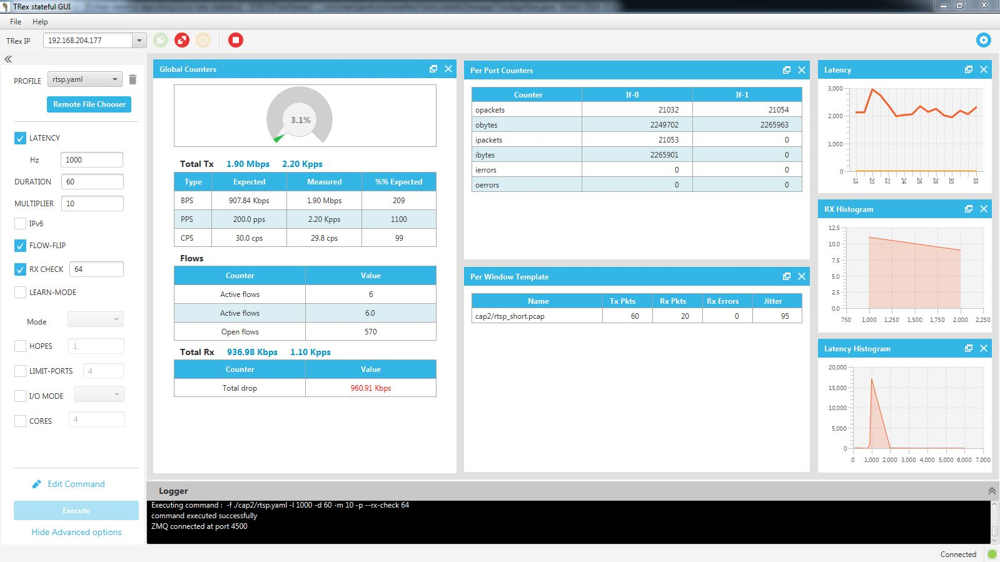
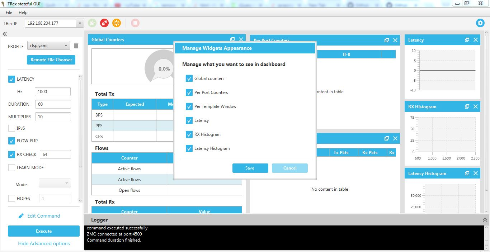
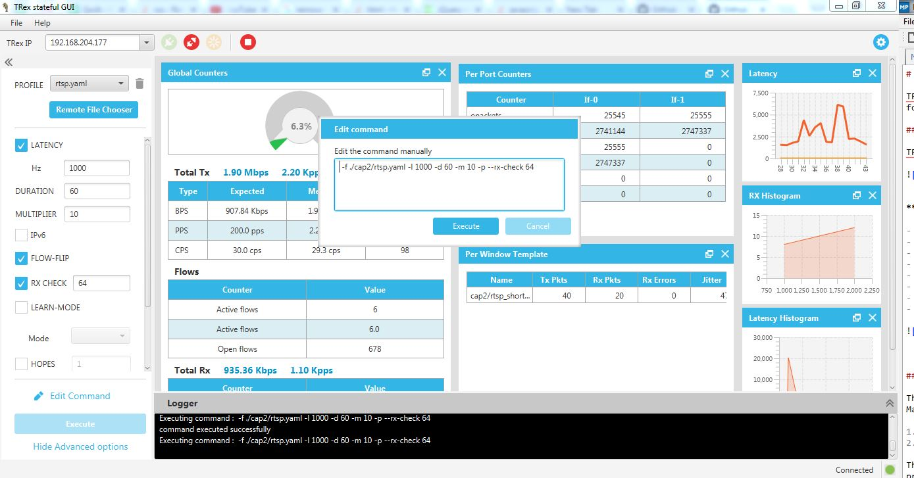
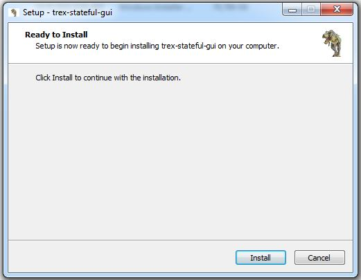
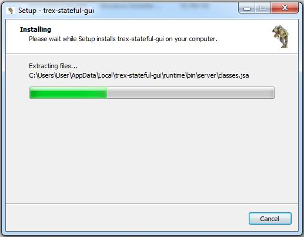

# TRex Stateful GUI 

TRex Stateful GUI application is used to view runtime notifications from TRex application. It gets JSON format messages on top of ZMQ messages and converts these messages into charts and tables.

## Description and main features:

TRex Stateful GUI application is a JavaFX based application.

**Main Features**

- Connects and manages TRex v2.09 and above.
- Ability to execute different TRex commands.
- Ability to edit TRex commands manually by user.
- Dashboard to view TX/RX information.
- Logger view to preview server messages.
- View Per port counters and per window template tables.
- View Latency chart , RX and Latency histograms
- Ability to manage views per user.

**Manage TRex views**

**Edit TRex Commands**

## Build a Native App

This section describes how to build a native application bundle (EXE for Windows and DMG for Mac).

1. `mvn clean jfx:native` (generates the native packaging using Maven).
2. Look for the the installer, DMG, or EXE in `(project)\target\jfx\native`.

This will build an installer for whatever platform you are building on. Building on a Mac will produce a Mac app. Building on a Windows PC will produce a Windows app.

## Building a Windows Installer and Native Application EXE

Building a Mac DMG or Windows EXE works straight of the box. However, Windows requires either WiX for MSI creation or Inno Setup for an EXE-based installer (both install an EXE for the JavaFX application along with a packaged JRE).

Both don't need to be installed, just whichever one gets you to your desired installer format.

### Build an EXE Installer with Inno Setup

Follow the steps below to create an EXE-based installer with Inno Setup and the JavaFX Maven plugin.

1. Download from [Inno Setup's site](http://www.jrsoftware.org/isinfo.php)
2. Install it (I defaulted most of the installation options)
3. Add `C:\Program Files (x86)\Inno Setup 5` to your system `Path` variable.

Once done, run `mvn jfx:native` to create an EXE based installer at `(project)\target\jfx\native`.

By running the EXE installer, it installs the JavaFX application to the user's local app data folder, as well as an uninstaller entry in the `Programs and Features` control panel. The application is also launched immediately following installation.

### Build an MSI with WiX

To install WiX and have the JavaFX Maven plugin use it during a build, do the following:

1. Download from [WiX's site](http://wixtoolset.org/)
2. Install it.
3. Add `C:\Program Files (x86)\WiX Toolset v3.10\bin` to your system `Path` variable.

Once that is complete, `mvn jfx:native` will create an MSI file in `(project)\target\jfx\native\bundles`.

Running the MSI installs the application to `C:\Program Files (x86)\(project name)` without prompt. Additionally, it creates an uninstaller listing in the `Programs and Features` control panel.

## Development environment and IDE

It is recommended to use **IntelliJ**. There is no need to install any additional plugins. Simply import the project.

## Installation Wizard

To install TRex, double click the installer binary and follow the instructions to complete the installation setup.

##  Contact Us

##  Installer

###  Windows Installer

You can find our Windows installer in the Release Tab.

###  Mac OS Installer

You can find our Mac installer in the Release Tab.

###  Linux RPM Installer

You can find our Linux RPM Beta installer in the Release Tab.

